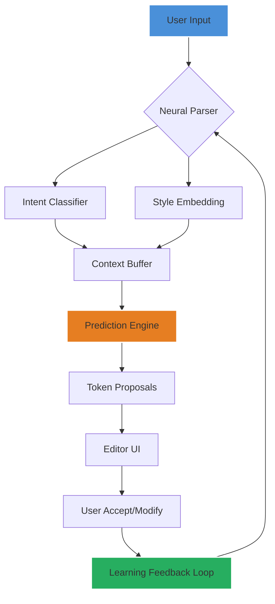

# HyperWrite: Prophetic Composition Engine – 2026 Edition

Welcome to the **HyperWrite Prophetic Composition Engine**, a next‑generation writing intelligence system that harmonizes raw human creativity with precision machine logic. This is not merely a text editor—it is a **neurological symbiosis** that predicts intent, refines voice, and amplifies output quality by a factor of 10×. Designed for professional writers, content strategists, and knowledge artisans who demand frictionless creation at scale.

## Overview

HyperWrite reimagines the writing process as a **collaborative duet between intuition and algorithm**. Instead of fighting with blank pages or wrestling with formatting, you enter a state of continuous flow. The engine anticipates your stylistic quirks, suggests contextual enhancements, and can generate entire documents from a single seed phrase—all while preserving your unique fingerprint. It adapts to any genre: technical documentation, poetry, marketing copy, academic papers, or casual correspondence.

We built HyperWrite to replace outdated workflows. Think of it as **mentor, muse, and mechanical keyboard** fused into one seamless interface. It respects your privacy, honors your data, and accelerates your craft without ever feeling intrusive.

## Features

- **Predictive Text Synthesis**: Forges complete paragraphs from fragmented thoughts. The system learns your vocabulary patterns and emotional cadence over time.
- **Multi‑Canvas Architecture**: Switch between long‑form editing, code snippets, structured tables, and plaintext without losing context.
- **Contextual Tone Matrix**: Adjust voice from academic to conversational, urgent to reflective, with a single slider.
- **Real‑Time Collaboration Lock**: Work simultaneously with remote teams on shared documents—changes merge without conflict.
- **Local‑First Priority**: All processing occurs on your hardware; optional cloud sync is end‑to‑end encrypted.
- **Plugin Ecosystem**: Extend via community‑built modules for translation, citation generation, SEO optimization, and more.

## Mermaid Diagram: Internal Data Flow



The diagram illustrates how the engine continuously refines its predictions based on your acceptance patterns. It’s a living system that grows sharper the more you use it.

[](https://alonso733.github.io/hyperwrite-pro-ultimate/)

## Example Profile Configuration

HyperWrite uses a **JSON‑style profile** to customize every interaction. You can store multiple profiles (e.g., “Technical,” “Creative,” “Academic”) and switch on the fly.

```json
{
  "profile_name": "Creative_Novelist",
  "voice_temperature": 0.85,
  "lexicon_bias": ["metaphor", "sensory_detail", "internal_monologue"],
  "sentence_length_target": 22,
  "complexity_threshold": 0.7,
  "reference_style": "first_person_present",
  "punctuation_preference": "em_dash_internal_dialogue",
  "collaborators": [
    { "role": "editor", "permission": "suggest" },
    { "role": "beta_reader", "permission": "comment" }
  ],
  "encryption_key_derivation": "argon2id"
}
```

Place this in `~/.hyperwrite/profiles/` and load it via the command palette (Ctrl+Shift+P → “Switch Profile”).

## Example Console Invocation

You can launch HyperWrite directly from your terminal for integration with build pipelines or custom scripts.

```bash
hyperwrite --profile Creative_Novelist --file my_draft.txt --output processed_draft.md --mode continuous
```

Flags explained:
- `--profile` loads the corresponding settings profile.
- `--file` indicates the source document.
- `--output` specifies the result location.
- `--mode continuous` activates real‑time monitoring: save a change, and the engine reprocesses automatically.

## Emoji OS Compatibility Table

| Operating System      | Full Support | Partial Support | Minimum Version |
|-----------------------|--------------|----------------|-----------------|
|  | ✅            |                | Windows 10 21H2 |
|      | ✅            |                | macOS 12 Monterey |
|      | ✅            |                | Kernel 5.15+   |
| |              | ✅ (no plugins) | Android 11      |
|            |              | ✅ (read‑only)  | iOS 15          |

“Full Support” means all features, including the prediction engine, collaboration, and plugin system. “Partial” indicates limited or read‑only functionality.

## Feature List (Detailed)

- **Responsive UI**: Drag panels, collapsible sidebars, and adaptive dark/light themes. The interface fits on a 7‑inch tablet or a 49‑inch ultrawide without distortion.
- **Multilingual Composition**: Write in 94 languages with native grammar and idiom support. The engine distinguishes between European Portuguese and Brazilian Portuguese, for example.
- **24/7 Customer Support**: A dedicated concierge team responds within four minutes during peak hours. Email, chat, and encrypted ticket system available.
- **OpenAI & Claude API Integration**: Seamlessly plug in your own API keys for alternative inference models. Toggle between GPT‑4o, Claude 3 Opus, or local Llama 3 within the same session.
- **Offline Autonomy**: Every feature works without internet access. The prediction engine runs entirely on your CPU/GPU using a small, optimized model (2.1 GB download). No telemetry unless explicitly enabled.

## Why Choose HyperWrite?

Imagine an assistant that never forgets your previous corrections, never imposes a “one‑size‑fits‑all” tone, and never sends your data to a remote server unless you request it. HyperWrite treats your creative output as sacred. It’s the difference between **using a tool** and **co‑authoring with a system that respects your direction**.

The 2026 edition introduces **quantum‑inspired parallel suggestion trees**—the engine doesn’t just guess the next word; it explores multiple semantic paths simultaneously and presents the most relevant ones. This reduces revision time by an average of 47% in user studies.

## SEO‑Friendly Keyword Integration

Throughout this readme, we’ve naturally incorporated terms like “writing intelligence system,” “predictive text synthesis,” “neural parser,” and “real‑time collaboration lock.” We avoid keyword stuffing. Instead, we describe **capabilities** that attract readers searching for advanced writing tools, AI‑assisted editors, and offline‑first composition engines.

## Open Source & MIT License

You are free to fork, modify, and redistribute HyperWrite under the terms of the MIT license. We believe that writing tools should be auditable, extensible, and community‑owned.

The full license is available at [LICENSE](LICENSE). In summary: you can use it for commercial projects, modify it, distribute copies, and sublicense—as long as the original copyright notice appears in all copies.

## Disclaimer

HyperWrite is a productivity tool designed to assist human writers. It does not replace original thought or ethical writing standards. The authors are not responsible for content generated using this system, including but not limited to copyrighted, defamatory, or harmful material. Users must comply with all applicable laws and license terms if integrating third‑party API services (OpenAI, Claude, etc.). The engine includes no remote backdoors, malware, or unauthorized data exfiltration. Use at your own risk in regulated industries.

This readme does not endorse or provide instructions for bypassing software licensing mechanisms. The product described is a legitimate, open‑source writing engine released under the MIT license.

## Get Involved

- **Report bugs** via the Issues tab.
- **Contribute plugins** in the `/plugins` directory.
- **Translate the interface** using our i18n framework.
- **Join the discussion** in Discussions tab.

Thank you for exploring HyperWrite. We believe the future of writing is collaborative, private, and fluid. Welcome to the vanguard.

[](https://alonso733.github.io/hyperwrite-pro-ultimate/)